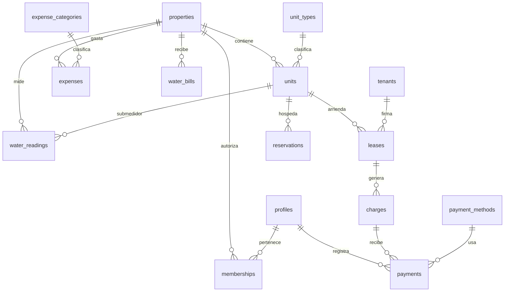

# 2 · Modelo de datos

Postgres sobre Supabase. Todo el catálogo es administrable desde la aplicación:
tipos de unidad, categorías de gasto, métodos de pago y usuarios son **filas**, no
constantes en el código.

## 2.1 Diagrama de relaciones

## 2.2 Entidades

### Catálogos administrables

| Tabla | Para qué | Campos clave |
|---|---|---|
| `unit_types` | Cuarto, Local comercial, Airbnb… | `name`, `slug`, `billing_mode`, `icon`, `sort_order` |
| `expense_categories` | Agua, Luz, Mantenimiento… | `name`, `slug`, `is_system` |
| `payment_methods` | Efectivo, Transferencia… | `name`, `slug`, `requires_reference` |

`billing_mode` distingue la lógica de cobro del tipo: `recurring` (renta periódica)
o `nightly` (Airbnb, se cobra por reservación). Así, agregar un tipo nuevo desde
Configuración no requiere tocar el código.

### Núcleo

**`properties`** — la propiedad. El sistema soporta varias desde el día uno aunque
sólo se use una.
`name`, `address`, `currency`, `timezone`, `settings jsonb`

**`units`** — cada cuarto, local o Airbnb.
`property_id`, `unit_type_id`, `name`, `number`, `description`, `base_rent`,
`billing_frequency`, `billing_day`, `deposit`, `status`, `active_from`, `is_active`, `notes`

- `billing_frequency`: `weekly` | `monthly` — **decisión derivada del hallazgo 1.4**
- `billing_day`: día del mes (1–28) o día de la semana (0–6) según la frecuencia
- `status`: `available` | `occupied` | `maintenance` | `inactive`
- `base_rent` es la renta *por periodo de cobro*, no mensual

**`tenants`** — inquilinos. Sobreviven a la salida de la unidad.
`full_name`, `phone`, `email`, `id_document`, `emergency_contact`, `notes`, `is_active`

**`leases`** — el contrato es lo que une inquilino y unidad en el tiempo. Es la pieza
que permite conservar el historial: cuando alguien se va, el contrato se cierra, no se borra.
`unit_id`, `tenant_id`, `starts_on`, `ends_on`, `rent_amount`, `billing_frequency`,
`billing_day`, `deposit_amount`, `grace_days`, `status`, `notes`

`status`: `active` | `ended` | `cancelled`

**`charges`** — un vencimiento: lo que se espera cobrar en una fecha concreta.
Se generan solos a partir del contrato.
`lease_id`, `unit_id`, `period_start`, `period_end`, `due_date`, `amount_expected`,
`concept`, `status`, `notes`

`status` se recalcula: `scheduled` | `pending` | `partial` | `paid` | `late` | `waived`

**`payments`** — un cobro recibido. Un cargo puede tener varios pagos (abonos).
`charge_id`, `lease_id`, `payment_method_id`, `paid_on`, `amount`, `reference`,
`notes`, `created_by`

**`expenses`** — gastos de la propiedad.
`property_id`, `expense_category_id`, `payment_method_id`, `incurred_on`, `concept`,
`amount`, `reference`, `notes`, `created_by`

### Agua

**`water_readings`** — bitácora diaria, fiel a las tres lecturas del Excel.
`property_id`, `unit_id` (nulo = medidor general), `read_on`, `reading_morning`,
`reading_afternoon`, `reading_next_morning`, `is_estimated`, `notes`

`is_estimated` marca los días que en el Excel se rellenaron con fórmulas manuales
(hallazgo 1.5 #8), para que no contaminen los promedios sin que nadie lo note.

**`water_rates`** — tarifa por m³ vigente en cada periodo. La tarifa cambió de $81 a
$101 a $93 entre mayo y agosto, así que no puede ser una constante.
`property_id`, `effective_from`, `rate_per_m3`

**`water_bills`** — el recibo del organismo, para contrastarlo con la bitácora.
`property_id`, `period_start`, `period_end`, `m3_billed`, `amount`, `status`, `notes`

### Airbnb (modelo listo, interfaz en fase 2)

**`reservations`**
`unit_id`, `guest_name`, `check_in`, `check_out`, `nights`, `nightly_rate`,
`gross_amount`, `commission`, `cleaning_fee`, `net_amount`, `status`, `notes`

`nights` y `net_amount` son columnas generadas: el sistema calcula, el usuario no.

### Usuarios y auditoría

**`profiles`** — extiende `auth.users` de Supabase.
`id` (= `auth.users.id`), `full_name`, `phone`, `avatar_url`

**`memberships`** — qué puede hacer cada usuario en cada propiedad.
`profile_id`, `property_id`, `role`

`role`: `owner` | `admin` | `viewer`. Los permisos se resuelven en la base de datos
mediante políticas RLS, no en el navegador: un usuario `viewer` no puede escribir
aunque manipule la interfaz.

**`audit_log`** — quién cambió qué y cuándo, para pagos, gastos, contratos y rentas.
`table_name`, `record_id`, `action`, `changed_by`, `old_data jsonb`, `new_data jsonb`, `created_at`

Toda tabla lleva `created_at`, `updated_at`, `created_by` y `deleted_at`.
**Los registros financieros no se borran**: `deleted_at` los oculta y quedan en el histórico.

## 2.3 Cálculos que la base de datos resuelve sola

| Cálculo | Dónde vive |
|---|---|
| Monto pagado de un cargo | Vista `charge_balances`: suma de sus pagos |
| Saldo pendiente | `amount_expected − monto pagado` |
| Estatus del cargo | Vista: compara saldo, fecha límite y fecha de pago |
| Días de atraso | Vista: fecha de pago o fecha actual contra fecha límite |
| Consumo diario de agua | Columnas generadas en `water_readings` |
| Resumen del mes | Vista `monthly_summary`: ingresos, egresos, utilidad, ocupación |
| Noches e ingreso neto de Airbnb | Columnas generadas en `reservations` |

Cada indicador se calcula en un solo lugar. No hay forma de que el dashboard y el
resumen mensual muestren números distintos.
